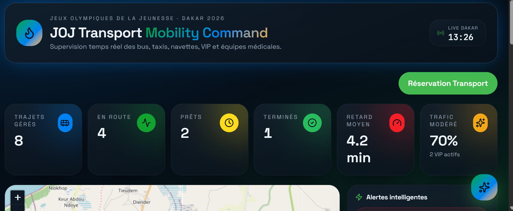
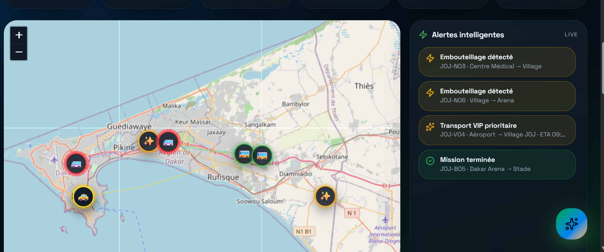
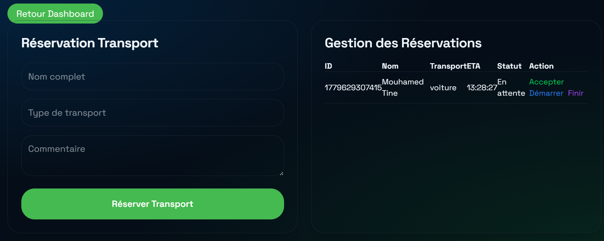
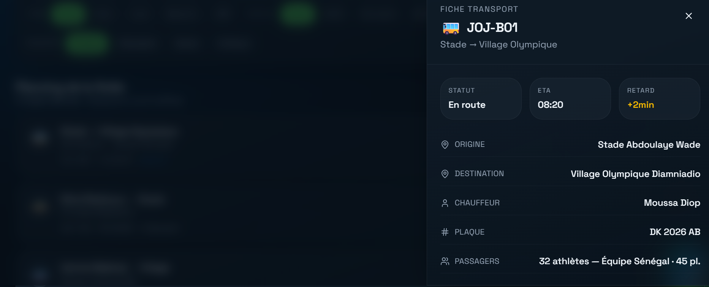
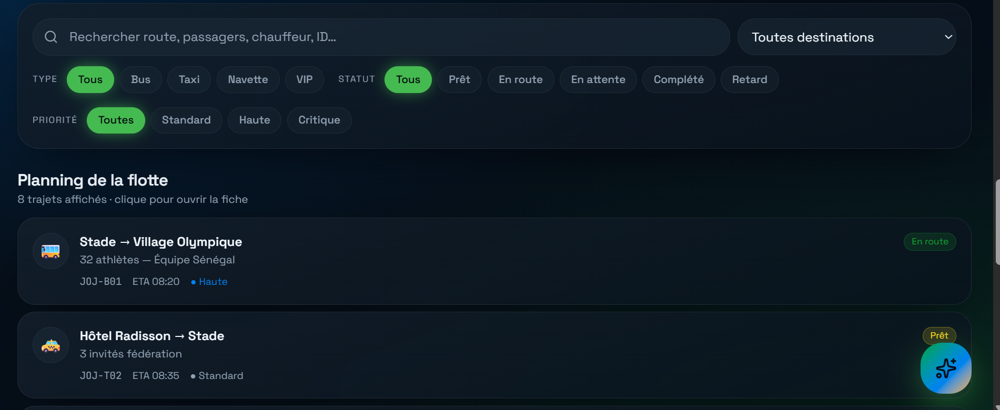

# JOJ_Dakar_2026

## Contexte de l'application
A l'occasion des JOJ(Jeux Olympiques de le Jeunesse) de 2026 à Dakar, une bonne organisation reste cependant indispenseable.
Sur ce plan une solution numérique permettant une gestion des traffics des personnels et athlètes ainsi que d’optimiser la gestion des déplacements entre les différents sites olympiques
est mise au point pour repondre à cette reaquette.

## Objectifs visés

L’application vise à :

- Simplifier les réservations de transport
- Faciliter le suivi des véhicules
- Améliorer l’expérience utilisateur
- Assurer une ponctualité des athlètes
- Suivie présise du traffic
- Assurer une securité dans le deplacement

 ## Fonctionnalités principales

### Gestion des transports
Consultation des véhicules disponibles selon les trajets et catégories grace au tableau de filtrage intégré.

###  Réservation
Formulaire moderne permettant d’effectuer une demande de réservation et d'affisage du statut du reservateur.

### Dashboard analytique
Visualisation des statistiques liées aux transports et personnels 
accompagner visualisation du statut des vehicule à temps réél.

### Suivi des trajets
Interface de visualisation des déplacements via une carte MAP intégrée.

### Filtres intelligents
Recherche rapide selon différents critères avec un chatbot.

##  Technologies utilisées

| Technologie     | Rôle                                                                |
| --------------- | ------------------------------------------------------------------- |
| React           | Construction d’une interface utilisateur dynamique et modulaire     |
| TypeScript      | Sécurisation du code grâce au typage statique                       |
| Vite            | Environnement de développement rapide avec rechargement automatique |
| Tailwind CSS    | Création d’une interface moderne, responsive et cohérente           |
| TanStack Router | Gestion de la navigation entre les différentes pages                |
| React Query     | Gestion optimisée des données et de leur mise à jour                |
| Framer Motion   | Ajout d’animations fluides pour améliorer l’expérience utilisateur  |

## Structure du projet

##  Structure du projet

```txt
src/              # Contient l’ensemble du code source
│── components/   # Composants réutilisables de l’interface
│── routes/       # Pages et navigation de l’application
│── assets/       # Images, icônes et ressources graphiques
│── hooks/        # Logiques réutilisables du projet
│── styles/       # Styles globaux de l’application
```
## Installation

### Cloner le projet

```bash
git clone https://github.com/username/joj-transport.git
```

### Installer les dépendances

```bash
npm install
```

### Lancer le projet

```bash
npm run dev
```

##  Aperçu de l'application

### Dashboard principal





### Réservation transport



### Fiche Transport(Staut actuel du vehicule consulter)


### Fitre Transport




## Difficultés rencontrées
Durant le développement, plusieurs défis ont été rencontrés :

- Gestion des dépendances npm
- Correction des erreurs TypeScript
- Configuration des routes de navigation
- Difficultés liées à la logique de développement assisté par IA (vibe coding)
- Appropriation de certaines technologies nouvelles

  ##  Améliorations futures

- Authentification des utilisateurs
- Notifications en temps réel
- Backend renforcé et sécurisé
- API de données transport
- Base de données solide

  ## Auteur

Développé par **Mouhamed Tine**  
Projet académique — JOJ_Dakar_2026
